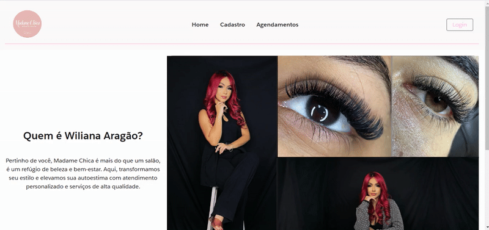

# 💅 💇‍♀️ Site de agendamento de procedimentos estéticos

Um projeto de um site que simula o agendamento em um salão de beleza com um design atrativo utilizando **HTML**, **CSS** e **JavaScript** com o framework **LWC** do SalesForce..  

---

## 📋 Funcionalidades

- Cadastro de Usuários no banco de dados SalesForce
- Login a partir dos user no BD
- Inserção de horários dinâmicos para agendamento inteligente
- personalização da logo para o UserName do cliente

---

## 🛠️ Tecnologias Utilizadas

- LWC (Lightning Web Component)
  *HTML
  *CSS
  *JavaScript
  *XML
  
- Apex

---
